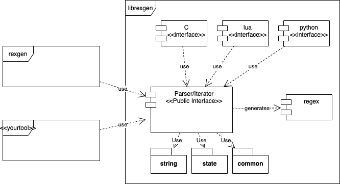
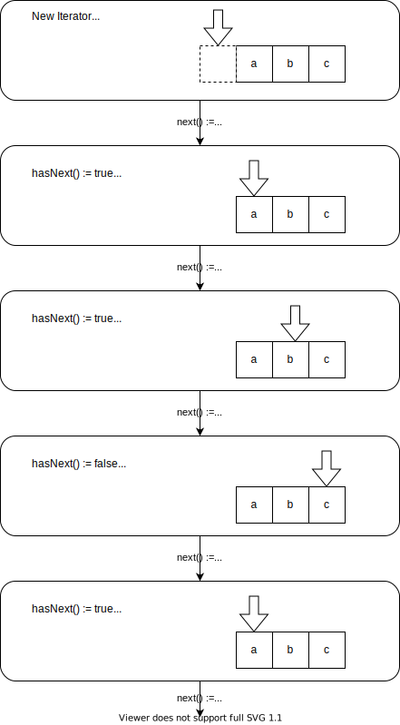
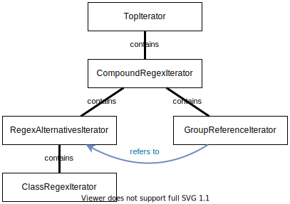

# Architecture and design decisions

The whole project consist of two main parts: `librexgen`, which does most of the work, and `rexgen`, which is a command line tool that provides most of the functionality two the user. In addition, `rexgen` is used to demonstrate how to use the `librexgen` API and to see if the API is sufficient and working.



# Regex and Iterators

Each regular expression is parsed into a Abstract Syntax Tree (AST) which uses the classes in the `regex` subfolder for data representation. All those classes are derived from `Regex`. Every `Regex` class provides a `iterator()` method which generates an `Iterator` (classes in the `iterator` subfolder). The `Iterator`s are responsible for generating values. There is one `Iterator`  class for every `Regex` class. For example, the `ClassRegex` generates a `ClassRegexIterator` instance.

After generating the AST, an `Iterator` is generated, whose shapes matches the shape of the AST, with a few small differences:

 - There are links in that skeleton tree, which are required by group references (see below)
 - `CompoundRegex` and `RegexAlternatives` generate no matching Iterator, if they contain only one child. Example for `CompoundRegex`: 
    ```C++

    std::unique_ptr<Iterator> CompoundRegex::singleIterator(IteratorState& state) const {
        if (regexObjects.size() == 1) {
        return regexObjects[0]->iterator(state);
        }
        /* ... */
    }
    ```

## The `Regex` class and subclasses

## Iterators

### Iterator Semantics

An `Iterator` generates a unlimited list of values, which repeat after some time. The following pseudocode demonstrates the basic use of iterators:

```C++
SimpleString value;
Iterator my_iter = my_regex.iterator();

while (my_iter.next()) {
    value.clear();
    my_iter.value(&value);
    printf("%s\n", value.c_str());
}
```

The next diagram shows the intended semantics of Iterator methods:



### What about `GroupReferenceIterator`?

Consider the following regular expression: `([abc])\1`. This would generate the following values:

```
aa
bb
cc
```

The `\1` is a reference to the regular expression `([abc])`. The generated `Iterator` tree looks like this (I skipped tree optimization for simplicity):



What does the `GroupReferenceIterator` really do? Nothing. When `value()` was called, it simply forwards the call to the references `Iterator`, and when `next()` was called, it only checks if was resetted if it where e real `Iterator` and returns that result. Take a look at the implementation:

```C++
inline bool hasNext() const override { return (state == resetted); }

inline bool next() override {
    bool res = (state == resetted);
    state = usable;
    return res;
}

inline void value(SimpleString *dst) const override {
    groupRef.get().value(dst);
}
```

# Working with Unicode

Internally, `librexgen` is working with multi byte characters for performance reasons. We use the exact same character encoding which is used for the output, so that no additional encoding must be done when generating the result strings.

# Further design decisions

|Topic|Explanation|
|-|---|
|`SimpleString` instead of `std::string`| `SimpleString` provides as `string`-like interface to work with multi byte character set strings. Because there is no standard C++ class for this purpose, I subclassed `std::string`|
|Storing a state| This is required by JtR to suspend/resume a session. However, the `StreamIterator` is not able to store a state, because not all streams are seekable (files are, pipes are not).|
|Lua-Interface| Can be used by nmap (nmap scripting engine uses Lua)|
|Python-Interface| Can be used by wfuzz|
|C-Interface| Can be used by ANSI-C programs, such as JtR|